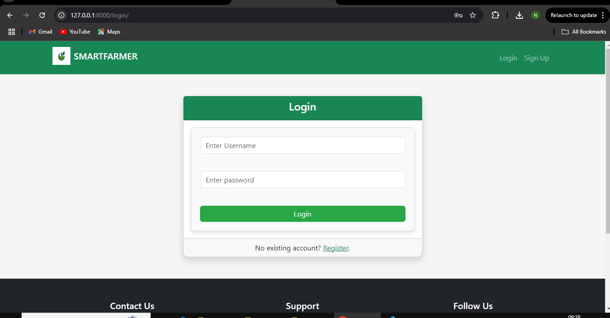
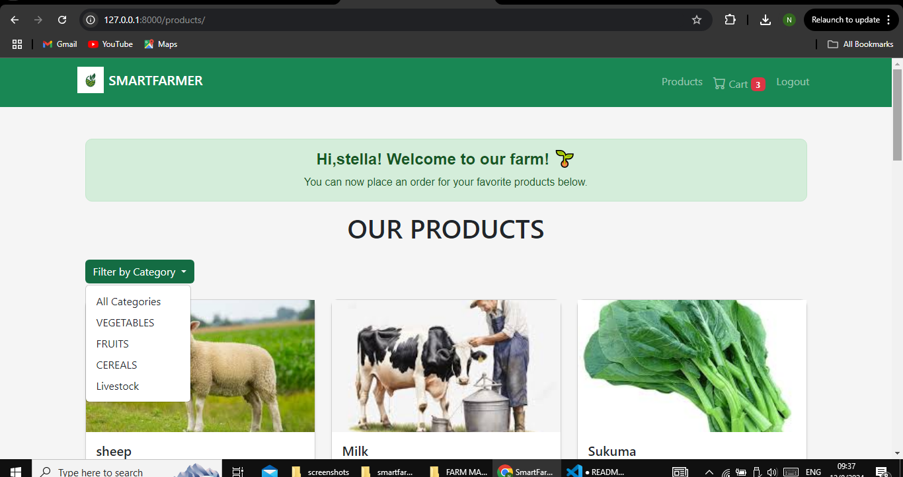
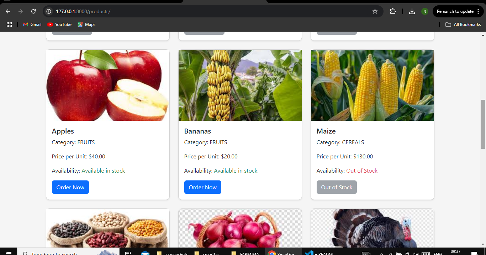
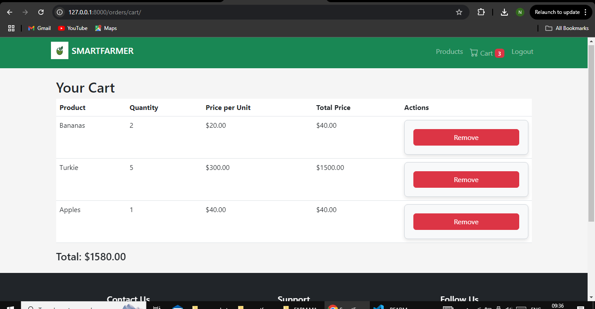

# SmartFarmer Farm Management System

## Description

SmartFarmer is a web-based farm management system built with Django. It allows the farmer to manage farm products, workers, and customer orders effectively.
For customers it allows them to view products and make orders as well as getting in touch with the farmer.

## Features

- User authentication (login/signup).
- Categorized product listing (livestock, crops).
- Admin panel for monitoring farm blocks and workers.
- Ability to place an order
- Cart functionality for customers.

## Installation

1. Clone the repository:
   ```bash
   git clone <https://github.com/halfa1/Farm-Management-System.git>
   cd smartfarmer
   ```
2. setup a virtual environment
   python -m venv env
   source env/bin/activate # Linux/macOS
   env\Scripts\activate # Windows

3. Install dependencies
   pip install -r requirements.txt
   or python -m pip install -r requirements.txt
4. Apply migrations and run the server:
   python manage.py migrate
   python manage.py runserver

5. Access the website at http://127.0.0.1:8000.

6. Admin Credentials
   Username: admin
   Password: admin123

- to access this create superuser using: python manage.py createsuperuser

## Contributions

Contributions are welcome! Please open a pull request or file an issue.

## Here are screenshots from my smartfarmer project

The login page looks like this:


The productlist page looks like this:

The productlist page looks like this:

The cart page looks like this:

